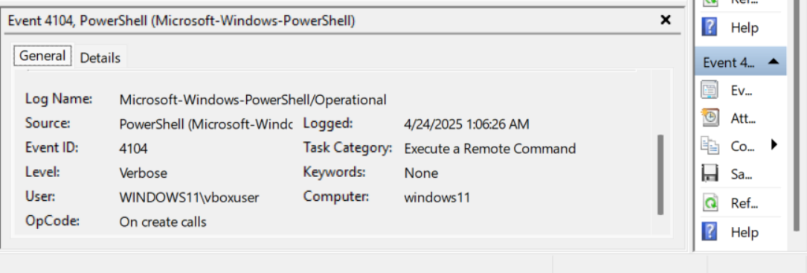
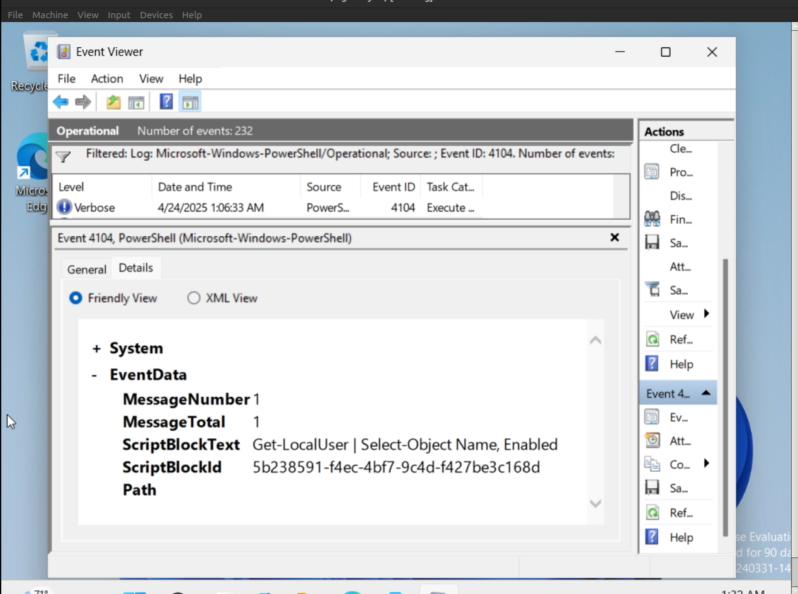

# PowerShell Event Log Analysis Report

## Metadata

- **System Name:** windows11
- **Log Source:** Microsoft-Windows-PowerShell/Operational
- **Event ID:** 4104
- **Date Analyzed:** April 24, 2025
- **User:** WINDOWS11\vboxuser
- **Log Level:** Verbose
- **Category:** Execute a Remote Command

## Overview of Event ID 4104

Event ID 4104 logs PowerShell script block execution. These entries are critical for detecting suspicious activity and auditing executed PowerShell commands.

## Key Findings

- **Event Time & Frequency:**  
  Events logged between 01:05:15 AM and 01:06:33 AM, indicating sequential PowerShell activity.
- **Command Executed:**  
  `Get-LocalUser | Select-Object Name, Enabled`  
  Purpose: Lists local users and their enabled status. A legitimate administrative command.
- **Security Context:**
  - User ID (SID): S-1-5-21-475613101-1680676069-1793336013-1000
  - Username: WINDOWS11\vboxuser
- **Execution Metadata:**
  - Process ID: 6996
  - Thread ID: 7364
  - ScriptBlockID: 5b238591-f4ec-4bf7-9c4d-f427be3c168d
- **Event Details:**
  - Version: 1
  - Opcode: 15 (On create calls)
  - Task Category: Execute a Remote Command

## Screenshots

### Screenshot 1: General event view

### Screenshot 2: General event view

### Screenshot 3: Details

### Screenshot 4: Details

## Interpretation

The PowerShell command observed is legitimate and expected within a lab or forensic analysis context. No obfuscation or malicious behavior detected.

## Verdict

No malicious activity detected. This appears to be a routine administrative command executed in a controlled environment.

## Recommendations

- Keep Script Block Logging enabled for future audits.
- In production environments, correlate such events with user logon and privilege use logs.
